# Modern AI Agent Architecture — A Developer's Blueprint

> **Purpose:** A platform-agnostic reference for building a production-grade AI assistant. Code boundaries are explicitly marked. RAG and document-retrieval are designed as opt-in modules you can enable when ready. All diagrams use Mermaid.

***

## 1. What Is a Modern AI Agent?

An AI agent is a system where a Large Language Model (LLM) acts as the reasoning engine within a *loop*: it perceives inputs, forms a plan, selects tools or delegates to sub-agents, observes results, and iterates until a goal is satisfied before emitting a final response. The critical distinction from a simple chatbot is that the agent *decides what to do next* at each step rather than issuing a single response.[^1][^2][^3]

By 2026, the dominant shift is from single all-purpose agents to **orchestrated teams of specialized agents** — AI's own "microservices moment" — with Gartner reporting a 1,445% surge in multi-agent system enquiries between Q1 2024 and Q2 2025.[^4]

***

## 2. Top-Level System Map

The diagram below shows the full agent system, including all optional (RAG) modules.

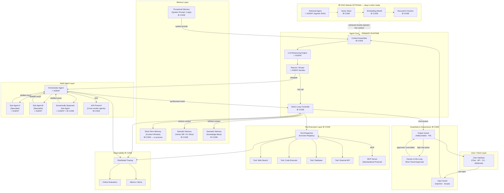

**Legend**
- 🤖 **AGENT** = decided/generated by the LLM at runtime
- ⚙️ **CODE** = deterministic logic written by the developer
- 📦 **OPTIONAL MODULE** = can be added later without refactoring the core

***

## 3. The ReAct Loop — The Heartbeat of Every Agent

The **ReAct (Reason + Act)** pattern, introduced by Yao et al. (2022), is the foundational loop of modern agents. The LLM does not just answer; it articulates a *thought*, selects an *action*, receives an *observation*, and iterates until it decides the task is complete.[^5][^6][^7]

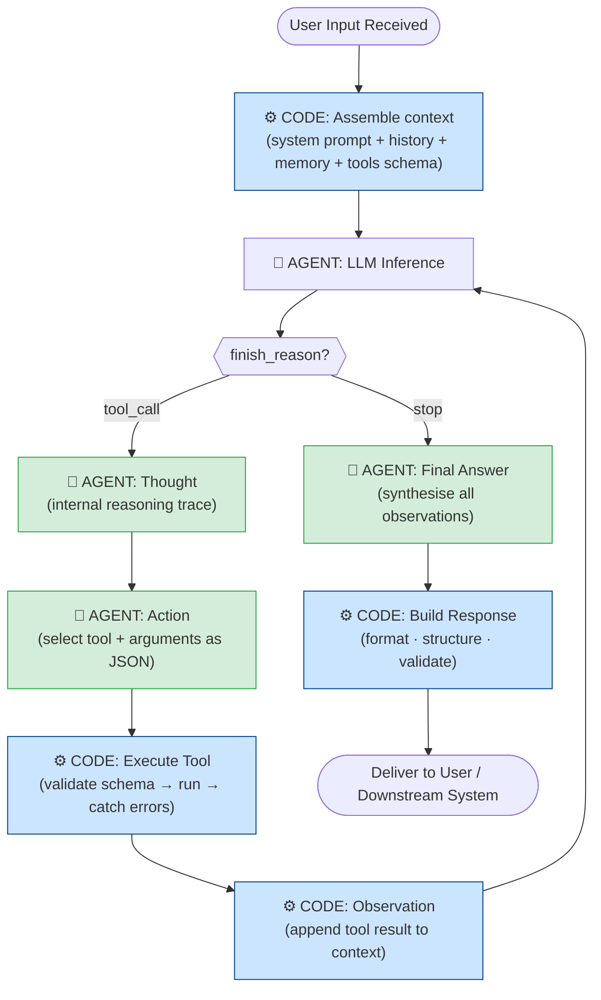

### What is code vs. what is the agent?

| Concern | Who handles it | Notes |
|---|---|---|
| Context assembly (prompts, history, tool schemas) | ⚙️ Code | Deterministic; engineered carefully[^8][^9] |
| Reasoning / planning | 🤖 Agent (LLM) | Non-deterministic; the "brain"[^10][^11] |
| Tool selection + argument generation | 🤖 Agent (LLM) | Outputs structured JSON[^12][^13] |
| Tool schema validation | ⚙️ Code | JSON Schema enforcement before execution |
| Tool execution | ⚙️ Code | The actual function/API call |
| Deciding to stop or continue | 🤖 Agent (LLM) | `finish_reason == "stop"` vs `"tool_calls"`[^14] |
| Response formatting | ⚙️ Code | Structured output contracts[^15][^16] |
| Error handling / retries | ⚙️ Code | Resilience layer[^17] |

***

## 4. Memory Architecture

Modern agents require four distinct memory tiers that work together.[^18][^19][^20]

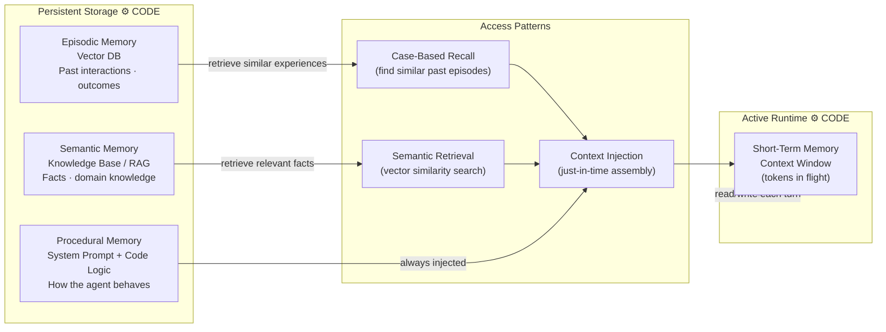

### Memory Type Reference

| Type | Storage | Persistence | Primary Use | Implementation |
|---|---|---|---|---|
| **Short-term** | In-process (context) | Session only | Active reasoning state | Token buffer / conversation list[^20] |
| **Episodic** | Vector DB / KV | Cross-session | Personalisation, case-based reasoning | Embedding + similarity search[^21][^19] |
| **Semantic** | Vector DB / Docs | Long-term | Domain knowledge, facts | RAG (see §7)[^19][^22] |
| **Procedural** | System prompt + code | Deployment | Behaviour rules, skills | Prompt templates + code logic[^20] |

**Context engineering** — assembling *exactly* the right information at the right time — has emerged as the primary reliability lever for 2026, replacing simple prompt tweaking. Most agents only operate with 20–30% of the context they could have; closing this gap dramatically improves output quality.[^8][^23][^9]

***

## 5. Tool Use and the MCP Integration Layer

Tools transform the LLM from a text generator into an actor in the world. The **Model Context Protocol (MCP)**, open-sourced by Anthropic in late 2024, has become the de-facto standard for tool integration — a "USB-C for AI agents".[^24][^25][^26][^27][^28]

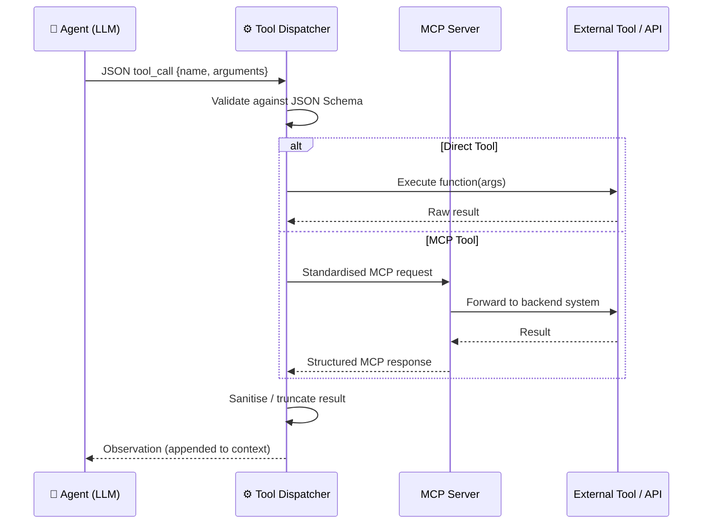

### Tool Definition Structure (language-agnostic)

```json
{
  "name": "search_web",
  "description": "Search the web for current information. Use when facts may be time-sensitive.",
  "parameters": {
    "type": "object",
    "properties": {
      "query": { "type": "string", "description": "Search query keywords" },
      "max_results": { "type": "integer", "default": 5 }
    },
    "required": ["query"]
  }
}
```

> **Key design rule:** Tool *descriptions* are read by the LLM to decide when and how to use them. Write descriptions as instructions to the agent, not as developer notes.[^2]

### Tool Taxonomy

| Category | Examples | Notes |
|---|---|---|
| **Read / Retrieve** | Web search, database query, file read | Safe to run without approval[^29] |
| **Write / Mutate** | Database update, file write, send email | Log and sample-audit[^29] |
| **Execute** | Code runner, shell, browser automation | Sandbox required[^30] |
| **Delegate** | Spawn sub-agent, call A2A remote agent | See §6[^31] |
| **High-risk** | Financial transaction, PII modification | Require HITL approval[^29][^30] |

***

## 6. Multi-Agent Architecture: Orchestrators, Sub-Agents, and Dynamic Spawning

Single-agent systems struggle with complexity, context limits, and parallel work. Multi-agent systems solve this by decomposing tasks across specialists.[^32][^2][^4]

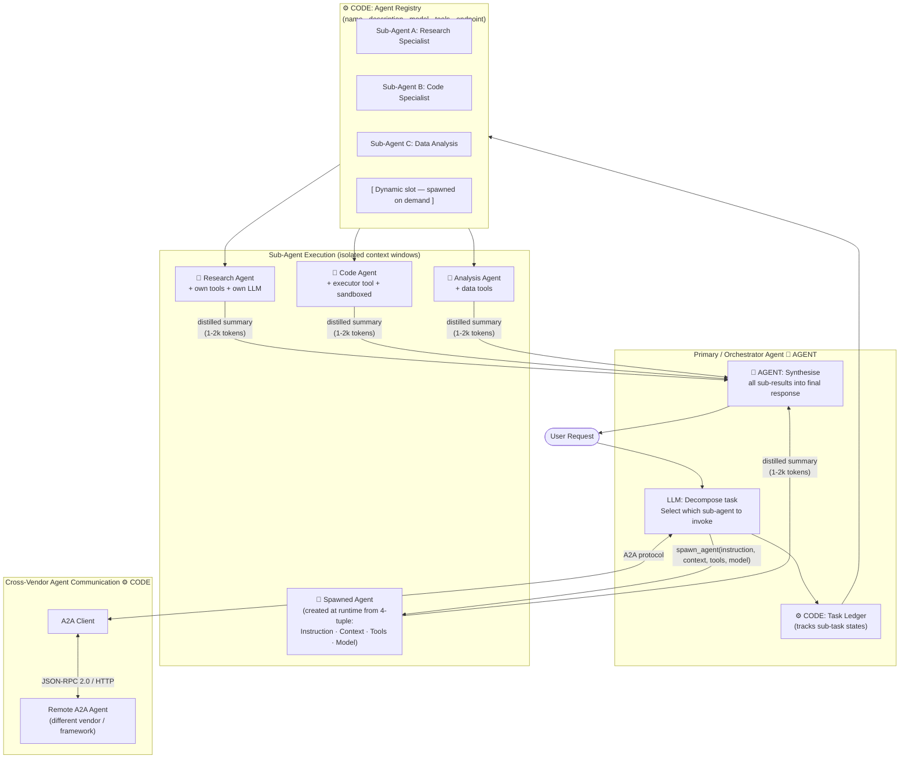

### Orchestration Strategy Guide

| Pattern | When to Use | Agent Decides? |
|---|---|---|
| **Single agent + tools** | Simple tasks, low complexity, low latency[^2][^33] | Yes — tool calls only |
| **Fixed sub-agents (registry)** | Known specialisations, predictable domains[^34][^32] | Partial — routing only |
| **Dynamic sub-agent spawning** | Open-ended tasks, unknown complexity at design time[^35][^36] | Yes — spawns on demand |
| **A2A remote agents** | Cross-vendor interop, third-party specialisations[^37][^38] | Partial — via protocol |
| **Parallel execution** | Independent sub-tasks that can run simultaneously[^35] | Code-orchestrated |

### Dynamic Sub-Agent Spawning (AOrchestra Pattern)

The most advanced pattern allows the orchestrator to create a sub-agent *at runtime* using a four-tuple specification:[^36]

```
sub_agent = spawn(
  instruction = "Summarise the competitive landscape for X",
  context     = { relevant_data },
  tools       = ["web_search", "document_reader"],
  model       = "fast-model"   // route by task complexity
)
```

Each spawned agent works in an **isolated context window** and returns only a condensed summary — preventing context pollution in the orchestrator. Anthropic's research showed this pattern delivers "substantial improvement" over single-agent systems on complex tasks.[^39]

***

## 7. RAG Module — Optional Document Intelligence

> **Modularity note:** The RAG module connects to the Context Assembler (§3) as a plug-in. When disabled, the agent uses only its trained knowledge and tool-retrieved data. Enable this module when you are ready to support attached or indexed documents.

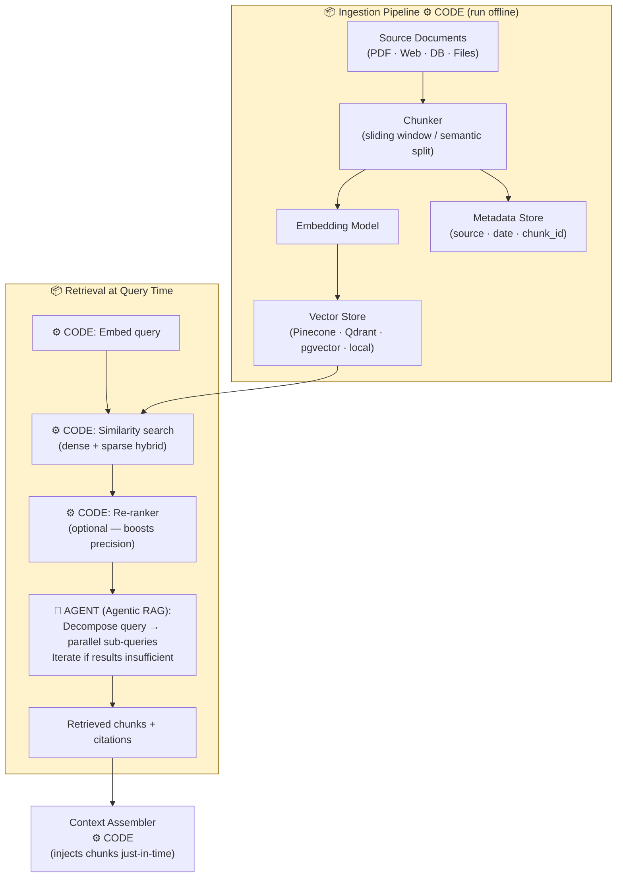

### RAG Evolution

| Generation | Behaviour | Complexity |
|---|---|---|
| **Naive RAG** | Single query → top-K chunks → inject | Low[^40] |
| **Advanced RAG** | Re-ranking, query rewriting, hybrid search | Medium[^40] |
| **Modular RAG** | Pluggable retrieval strategies, fine-tuned retrievers | High[^40] |
| **Agentic RAG** | Agent decomposes query, selects retrieval strategy, iterates | Highest[^41][^42][^43] |

**Start with Naive RAG** for your first document integration. Promote to Agentic RAG when queries become complex or multi-document.[^43]

***

## 8. Response Synthesis — Beyond Question-and-Answer

A production agent must go far beyond returning a text string. Response synthesis is the final assembly step where the agent's reasoning, tool results, and sub-agent outputs are merged into a structured, validated, delivery-ready payload.[^15][^16]

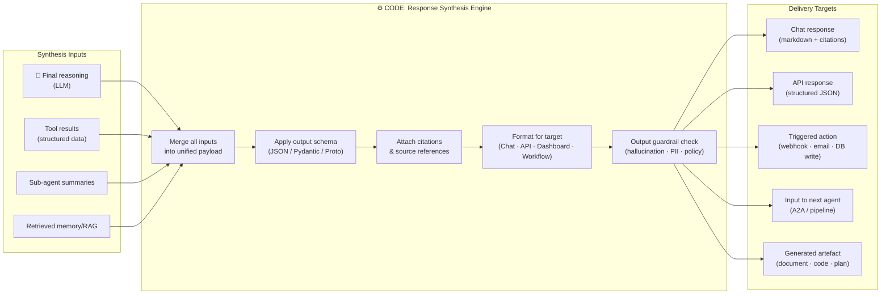

**Simple Q&A sessions** are efficiently handled by short-circuiting the multi-agent layer: the context assembler feeds the LLM directly, the agent emits `finish_reason: stop` without tool calls, and the synthesis engine applies the chat formatter. No sub-agents are spawned; no RAG retrieval fires unless a document context flag is present.

***

## 9. Guardrails and Safety Architecture

Guardrails operate at the entry and exit of every agent boundary — never as a single check, but as a layered defence.[^29][^44][^30]

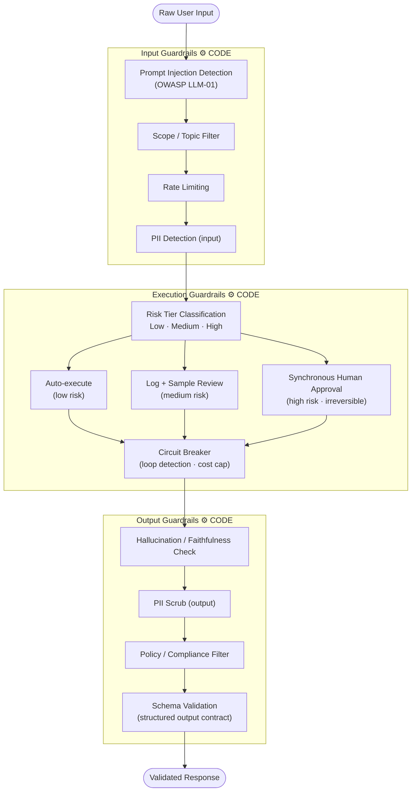

### Risk-Tiered Human-in-the-Loop (HITL)

| Risk Tier | Action Type | Oversight Model |
|---|---|---|
| **Low** | Read-only queries, lookups, chat | Fully automated[^29] |
| **Medium** | Write operations, external comms | Async log + sampled human review[^29] |
| **High** | Financial, PII modification, irreversible | Synchronous approval required[^29][^30] |
| **Prohibited** | Defined per deployment | Hard block — never executed |

***

## 10. Observability Architecture

Production agents without observability are black boxes. Gartner found that 94% of teams with agents in production have some form of observability in place.[^45]

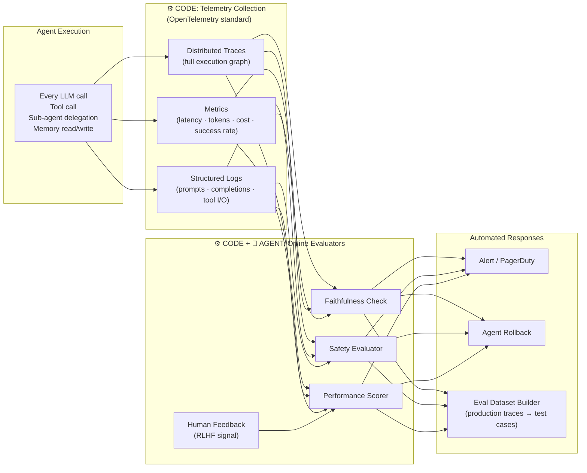

**Five observability pillars** to instrument from day one:[^46]
1. **Traces** — capture every step, tool call, and sub-agent invocation with a shared trace ID
2. **Metrics** — latency (p95 target <3s), token usage, cost per call, success rate (target >99%)
3. **Logs** — raw prompts, completions, and tool I/O (tokenise sensitive fields)
4. **Online Evaluations** — automated faithfulness, safety, and PII checks per response
5. **Human Feedback** — sparse labels fed back as reinforcement signal

***

## 11. Agent Interoperability Protocols

Two complementary open standards now define how agents connect to the world:[^26][^27][^37][^38][^47]

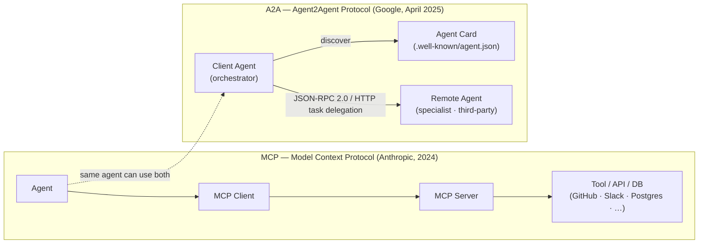

| Protocol | Purpose | Interaction Model | Standardised By |
|---|---|---|---|
| **MCP** | Agent ↔ Tool / Data Source | Stateless, transactional[^27] | Anthropic (open source) |
| **A2A** | Agent ↔ Agent | Stateful, multi-turn, negotiative[^37][^38] | Google / Linux Foundation |
| **ACP** | Agent ↔ Agent (alt.) | Multi-turn, open governance[^48] | IBM / Linux Foundation |

***

## 12. Complete Data Flow — Simple Q&A vs. Complex Task

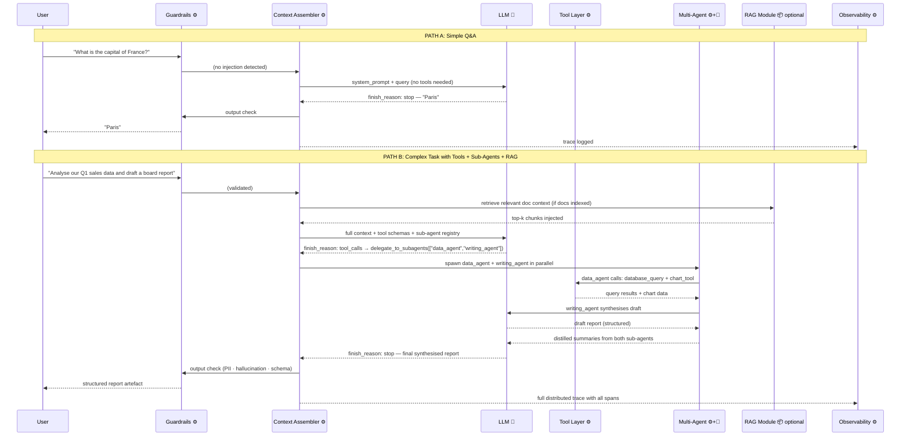

***

## 13. Implementation Checklist

Use this as a progressive build guide. Implement in order; each layer depends on the previous.

### Phase 1 — Core Agent (MVP)
- [ ] System prompt with clear role, constraints, and output format (procedural memory)
- [ ] Conversation history management (short-term memory — rolling window or summarisation)
- [ ] At least one tool with a JSON Schema definition
- [ ] ReAct loop: LLM call → check finish_reason → execute tools → loop
- [ ] Structured output schema for responses
- [ ] Basic input guardrail (prompt injection filter)
- [ ] Trace logging (trace_id on every LLM call + tool call)

### Phase 2 — Persistent Memory + Context Engineering
- [ ] Episodic memory store (vector DB) — store + retrieve past interactions
- [ ] Semantic memory / knowledge base (even just a static document set)
- [ ] Just-in-time context assembly (inject only relevant memory, not all history)
- [ ] Context compaction strategy (summarise when approaching context limit)
- [ ] Structured note-taking for long-horizon tasks

### Phase 3 — Multi-Agent
- [ ] Agent Registry (name, description, model, tools, endpoint)
- [ ] Orchestrator routing logic (LLM decides which sub-agent; code enforces)
- [ ] Sub-agent isolation (each gets a clean context window)
- [ ] Result synthesis (orchestrator merges distilled summaries)
- [ ] Dynamic spawning hook (spawn_agent with 4-tuple: instruction, context, tools, model)
- [ ] Parallel execution for independent sub-tasks

### Phase 4 — Production Hardening
- [ ] MCP server for standardised tool integration
- [ ] A2A client/server for cross-system agent interop
- [ ] Risk-tiered HITL (classify every tool action: low/medium/high)
- [ ] Output guardrails (hallucination check, PII scrub, schema validation)
- [ ] Circuit breakers (max tool call iterations, cost caps, loop detection)
- [ ] Online evaluators (faithfulness, safety — run per response)
- [ ] Metrics dashboards (success rate, p95 latency, token cost)

### Phase 5 — RAG Module (when document support is needed)
- [ ] Document ingestion pipeline (chunk → embed → store)
- [ ] Hybrid retrieval (dense + sparse / BM25)
- [ ] Re-ranker for precision
- [ ] Agentic RAG wrapper (agent decomposes query, iterates if needed)
- [ ] Citation tracking (chunk_id → source → passage)
- [ ] Plug RAG output into Context Assembler as optional inject

***

## 14. Design Principles Summary

| Principle | Implication |
|---|---|
| **Modularity** | Separate planning, memory, tools, RAG, and execution for independent testability[^17] |
| **Least privilege** | Every agent and tool gets only the access it needs[^30] |
| **Context is the product** | Invest as much in context engineering as in prompt writing[^8][^23] |
| **Distil, don't dump** | Sub-agents return summaries (1–2k tokens), not full context[^39] |
| **Code owns determinism** | Tool execution, schema validation, and error handling are always code — never delegate these to the LLM[^31] |
| **Observability first** | Instrument before you optimise — traces reveal what reasoning and benchmarks hide[^46][^45] |
| **RAG is a module** | Keep retrieval decoupled from the core loop so it can be activated, swapped, or upgraded without refactoring[^40] |
| **Fail gracefully** | Circuit breakers, retries with backoff, and fallback responses at every integration point[^17] |

---

## References

1. [AI in 2026: Architectures for a World of Agents](https://dainstudios.com/insights/ai-in-2026-architectures-for-a-world-of-agents/) - AI in 2026 requires new architectures built for agents, flexibility and control. Learn how to design...

2. [Choose a design pattern for your agentic AI system](https://docs.cloud.google.com/architecture/choose-design-pattern-agentic-ai-system) - Learn how to select an agent design pattern to build your agentic system.

3. [A Complete Guide to AI Agent Architecture in 2026 - Lindy](https://www.lindy.ai/blog/ai-agent-architecture) - An AI agent architecture defines how an agent functions. Explore 3 key models, components, and how A...

4. [7 Agentic AI Trends to Watch in 2026](https://machinelearningmastery.com/7-agentic-ai-trends-to-watch-in-2026/) - Discover the seven emerging trends reshaping agentic AI in 2026, from multi-agent orchestration to p...

5. [The ReAct Framework: Synergizing Reasoning and Acting](https://apxml.com/courses/agentic-llm-memory-architectures/chapter-2-advanced-agent-architectures-reasoning/react-framework-reasoning-acting)

6. [Implementing ReAct Agentic Pattern From Scratch](https://www.dailydoseofds.com/ai-agents-crash-course-part-10-with-implementation/) - AI Agents Crash Course—Part 10 (with implementation).

7. [ReAct-based Agent Architecture](https://www.emergentmind.com/topics/react-based-agent-architecture) - ReAct-based agent architecture interleaves reasoning and action, enabling LLMs to update plans dynam...

8. [Context Engineering: The Full Stack for AI Agents - Zilliz blog](https://zilliz.com/blog/why-context-engineering-is-becoming-the-full-stack-of-ai-agents) - Discover how context engineering unifies prompts, RAG, and tools to build smarter, production-ready ...

9. [Context Engineering: The Next Frontier Beyond Prompt ...](https://www.deepset.ai/blog/context-engineering-the-next-frontier-beyond-prompt-engineering) - This article explores how designing the right informational environment is the key to building sophi...

10. [Architecting AI Agents: Frameworks, Tools, and Patterns You Need ...](https://bklug.ai/blog/architecting-ai-agents-frameworks-tools-and-patterns-you-need-to-know) - A deep dive into the essential frameworks, design patterns, and tools shaping next-gen AI agents acr...

11. [How to Build AI Agents: Full Roadmap for 2026](https://brightdata.com/blog/ai/ai-agents-roadmap) - Learn how to build AI agents from scratch. Explore components, types, tech stacks, and step-by-step ...

12. [Function Calling and Tool Use: Enabling Practical AI Agent ...](https://mbrenndoerfer.com/writing/function-calling-tool-use-practical-ai-agents) - A comprehensive guide covering function calling capabilities in language models from 2023, including...

13. [The guide to structured outputs and function calling with ...](https://agenta.ai/blog/the-guide-to-structured-outputs-and-function-calling-with-llms) - Get reliable JSON from any LLM using structured outputs, JSON mode, Pydantic, Instructor, and Outlin...

14. [Function Calling vs Tool Use in AI Agents](https://propelius.ai/blogs/function-calling-vs-tool-use-ai-agents/) - Understand the difference between function calling and tool use in AI agents. Learn when to use each...

15. [AI Agents in 2026: Beyond Chat to Autonomous Development](https://zircote.com/blog/2026/02/ai-agents-in-2026-beyond-chat-to-autonomous-development/) - If you're building AI agents in 2026: Start with structured output: Define schemas before prompts. E...

16. [How do I get my agent to respond in a structured format like ...](https://techcommunity.microsoft.com/blog/azuredevcommunityblog/how-do-i-get-my-agent-to-respond-in-a-structured-format-like-json/4433108) - Not every agent needs to speak JSON, but if your response is going anywhere beyond the chat window, ...

17. [AI Agent Architecture: Concepts, Components & Best ...](https://www.leanware.co/insights/ai-agent-architecture-concepts-components-best-practices) - AI agents are moving from research labs into production systems that automate decisions, assist user...

18. [Day 4 - Agent Memory Systems: Short-term, Long- ...](https://www.linkedin.com/pulse/day-4-agent-memory-systems-short-term-long-term-episodic-marques-rp3ge) - Unlike episodic memory, which deals with specific events, semantic memory contains generalized infor...

19. [The 3 Types of Long-term Memory AI Agents Need](https://machinelearningmastery.com/beyond-short-term-memory-the-3-types-of-long-term-memory-ai-agents-need/) - The Three Pillars of Long-term Agent Memory · Episodic Memory: Learning from Experience · Semantic M...

20. [Agents: Short vs. Long-term Memory in 2 Mins](https://www.decodingai.com/p/agents-short-vs-long-term-memory) - Here's a breakdown of short and long-term memory types: Short ... Context Engineering: 2025's #1 Ski...

21. [What Is AI Agent Memory? Types, Tradeoffs and ...](https://www.techtarget.com/searchenterpriseai/tip/What-is-AI-agent-memory-Types-tradeoffs-and-implementation) - Types of AI agent memory. AI agents can use two broad types of memory: short-term memory and long-te...

22. [AI Agent Memory](https://www.geeksforgeeks.org/artificial-intelligence/ai-agent-memory/) - There are different types of long-term memory: Episodic Memory: This type remembers specific events ...

23. [AI Agents in 2026: 8 Trends to Watch](https://www.linkedin.com/pulse/ai-agents-2026-8-trends-watch-ali-ibrahim-htruf) - Context engineering replaced prompt tweaking as the reliability lever. 2026 is when they specialize....

24. [How AI Agents Use Tools with Function Calling - Engineering Notes](https://notes.muthu.co/2025/10/how-ai-agents-use-tools-with-function-calling/) - 1. Concept Introduction Think about a smart assistant like Siri or Google Assistant. When you ask, “...

25. [Chapter 5: Tool Use (Function Calling): Extending AI Agents to Interact with the Real World](https://www.youtube.com/watch?v=lh5ESPeuR2M) - Master the crucial Tool Use design pattern, often implemented through Function Calling, which is ess...

26. [Building effective AI agents with Model Context Protocol (MCP)](https://developers.redhat.com/articles/2026/01/08/building-effective-ai-agents-mcp) - Learn how Model Context Protocol (MCP) enhances agentic AI in OpenShift AI, enabling models to call ...

27. [What is Model Context Protocol (MCP)? - IBM](https://www.ibm.com/think/topics/model-context-protocol) - Model context protocol (MCP) serves as a standardization layer for AI applications to communicate ef...

28. [Put AI Agents to Work Faster Using MCP](https://www.bcg.com/publications/2025/put-ai-to-work-faster-using-model-context-protocol) - MCP is like a USB-C port for AI agents—a standardized link that greatly reduces the headaches of con...

29. [Why AI Agents Need Guardrails and How to Build Them](https://www.rocketfarmstudios.com/blog/why-ai-agents-need-guardrails-and-how-to-build-them/) - Learn how to build AI agent guardrails with least privilege identities, circuit breakers, human appr...

30. [Safety & Guardrails for Agentic AI Systems (2025)](https://skywork.ai/blog/agentic-ai-safety-best-practices-2025-enterprise/) - Discover defense-in-depth best practices for agentic AI safety in 2025: layered guardrails, operatio...

31. [Agent orchestration - OpenAI Agents SDK](https://openai.github.io/openai-agents-python/multi_agent/) - Agent orchestration · Allowing the LLM to make decisions: this uses the intelligence of an LLM to pl...

32. [How Rovo Chat embraces multi-agent orchestration](https://www.atlassian.com/blog/atlassian-engineering/how-rovo-embraces-multi-agent-orchestration) - To improve the reliability, we structure the orchestration into hierarchal layers of subagents, allo...

33. [Agent system design patterns | Databricks on AWS](https://docs.databricks.com/aws/en/generative-ai/guide/agent-system-design-patterns) - An overview of recommended design patterns for generative AI agent systems. Includes practical advic...

34. [Spring AI Agentic Patterns (Part 4): Subagent Orchestration](https://spring.io/blog/2026/01/27/spring-ai-agentic-patterns-4-task-subagents) - LLM decides to delegate by invoking the Task tool with the subagent name and task description. Task ...

35. [Deep Agents: A New Concept on Lang Multi ...](https://www.linkedin.com/pulse/deep-agents-new-concept-lang-multi-agent-framework-gihan-lakmal-yhkfc) - Dynamic Subagent Creation. Primary agents can spawn specialized sub-agents on demand, each focused o...

36. [AOrchestra: Automating Sub-Agent Creation for ...](https://arxiv.org/html/2602.03786v1) - In this work, we present AOrchestra, an orchestration-centric agentic system that automates sub-agen...

37. [The New Standard for AI Agent Collaboration - A2A Protocol](https://a2aprotocol.ai/blog/2025-full-guide-a2a-protocol) - A2A (Agent2Agent Protocol) is the first open standard protocol designed specifically for communicati...

38. [Announcing the Agent2Agent Protocol (A2A)](https://developers.googleblog.com/en/a2a-a-new-era-of-agent-interoperability/) - Explore A2A, Google's new open protocol empowering developers to build interoperable AI solutions.

39. [Effective context engineering for AI agents](https://www.anthropic.com/engineering/effective-context-engineering-for-ai-agents) - In this post, we'll explore the emerging art of context engineering and offer a refined mental model...

40. [RAG, AI Agents, and Agentic RAG: An In-Depth Review ...](https://www.digitalocean.com/community/conceptual-articles/rag-ai-agents-agentic-rag-comparative-analysis) - This article thoroughly explores RAG, AI agents, and Agentic RAG, emphasizing their theoretical back...

41. [[2501.09136] Agentic Retrieval-Augmented Generation](https://arxiv.org/abs/2501.09136) - by A Singh · 2025 · Cited by 288 — This survey provides a comprehensive exploration of Agentic RAG, ...

42. [How to Build Agentic RAG Systems: Patterns, Architecture ...](https://www.linkedin.com/pulse/how-build-agentic-rag-systems-patterns-architecture-tools-moorthy-t2wyc) - Retriever Agent: Retrieve necessary contexts from external sources, multiple agents may be necessary...

43. [Retrieval Augmented Generation (RAG) in Azure AI Search - Microsoft](https://learn.microsoft.com/en-us/azure/search/retrieval-augmented-generation-overview) - Learn how Azure AI Search supports RAG patterns with agentic retrieval and classic hybrid search to ...

44. [Guardrails in AI and AI Agents: Evolution Through 2025 ...](https://www.linkedin.com/pulse/guardrails-ai-agents-evolution-through-2025-new-era-2026-kamboj-0bwec) - AI guardrails are the technical and procedural controls that establish boundaries for AI system beha...

45. [State of AI Agents](https://www.langchain.com/state-of-agent-engineering) - LangChain provides the engineering platform and open source frameworks developers use to build, test...

46. [Agent Observability: The Definitive Guide to Monitoring ...](https://www.getmaxim.ai/articles/agent-observability-the-definitive-guide-to-monitoring-evaluating-and-perfecting-production-grade-ai-agents/) - TL;DR: Agent observability goes far beyond traditional logging or APM. It gives teams full visibilit...

47. [What Is Agent2Agent (A2A) Protocol?](https://www.ibm.com/think/topics/agent2agent-protocol) - The Agent2Agent (A2A) protocol is an open communication protocol for artificial intelligence (AI) ag...

48. [MCP and A2A - Agent Communication Protocol](https://agentcommunicationprotocol.dev/about/mcp-and-a2a) - How does ACP compare to other AI protocols

